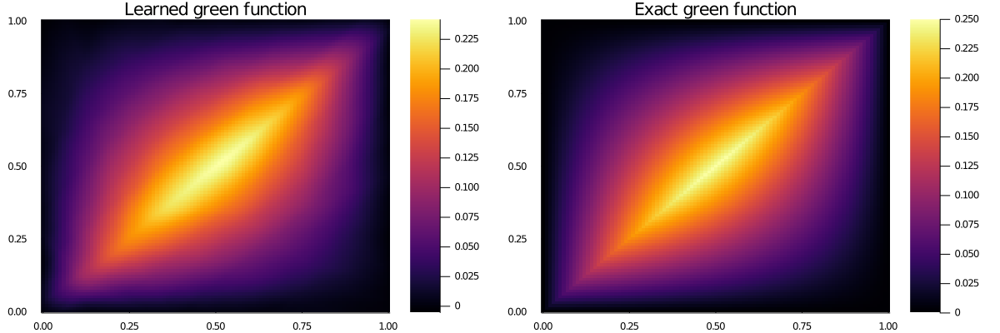

# GreenLearning.jl
Julia implementation of greenlearning

Original implementation written in Python
- [arXiv](https://arxiv.org/abs/2105.00266)
- [GitHub](https://github.com/NBoulle/greenlearning)
- [Document](https://greenlearning.readthedocs.io/en/latest/)

## Set Up
```bash
git clone git@github.com:yonesuke/GreenLearning.jl.git
cd GreenLearning.jl; git submodule update --init --recursive
```

## Example
Laplace equation
