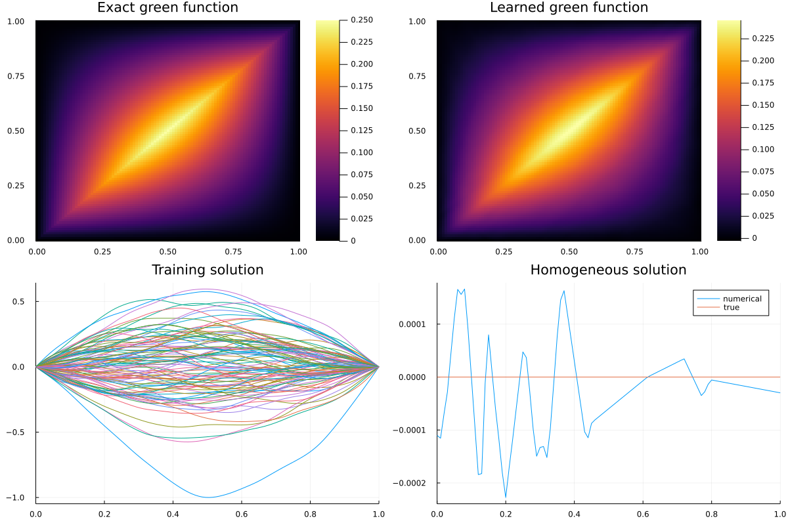
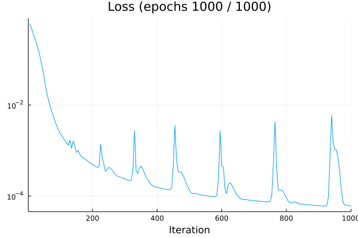

# GreenLearning.jl
Julia implementation of greenlearning

Original implementation written in Python
- [arXiv](https://arxiv.org/abs/2105.00266)
- [GitHub](https://github.com/NBoulle/greenlearning)
- [Document](https://greenlearning.readthedocs.io/en/latest/)

## Set Up
```bash
git clone git@github.com:yonesuke/GreenLearning.jl.git
cd GreenLearning.jl; git submodule update --init --recursive
```

## How to run
To train neural network, run the following.
```bash
julia train.jl <EQUATION NAME> <EPOCHS>
```
For example, if you want to learn the green function of the Laplace equation with 100 epochs,
this command `julia train.jl laplace 100` will do.

Trained model is saved to `chekpoints_<EQUATION_NAME>_<DATE>/model_<Nth_EPOCH>.bson` for every five epochs.

Load the trained model with the following.
```julia
julia> using BSON: @load
julia> @load "chekpoints_<EQUATION_NAME>_<DATE>/model_<Nth EPOCH>.bson" G_network U_hom_network opt
```

## Example
- Laplace equation

    Green function and homogeneous solution
    
    
    
    Loss through iteration
    
    
    
    Convergence of green function through iteration
    
    

